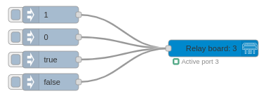
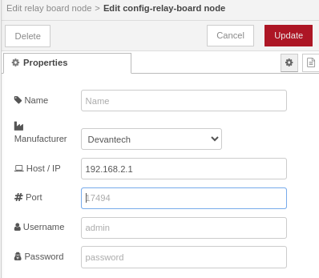
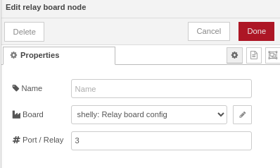

# node-red-contrib-relaycontrol

A module that allows controlling different relay boards from Node-RED.

Tested with:
- Devantech ETH008 - there are several different models available, ranging from 2x16A to a 32x16A relay board. See https://www.robot-electronics.co.uk/products/relay-modules/ethernet-relay.html
- Shelly Pro 4PM V2 - Offering 4x16A relays. See https://shelly-api-docs.shelly.cloud/
- Teracom TCW181B-CM - TCW181B-CM is an Ethernet digital IO module for monitoring of one and control up to eight devices per unit. See https://www.teracomsystems.com/ethernet/digital-io-module-tcw181b-cm/

# Flow

A typical flow consists of a node injecting either a `0` / `1` or `true` / `false` into the node. The node will respond to switch the attached relay.  

# Configuration

Each board in the network needs to be configured first. Depending on the manufacturer, you may need to fill out either only the IP address/hostname or some additional fields.

Once the board has been configured and selected, the _port_ for the relay needs to be added.
